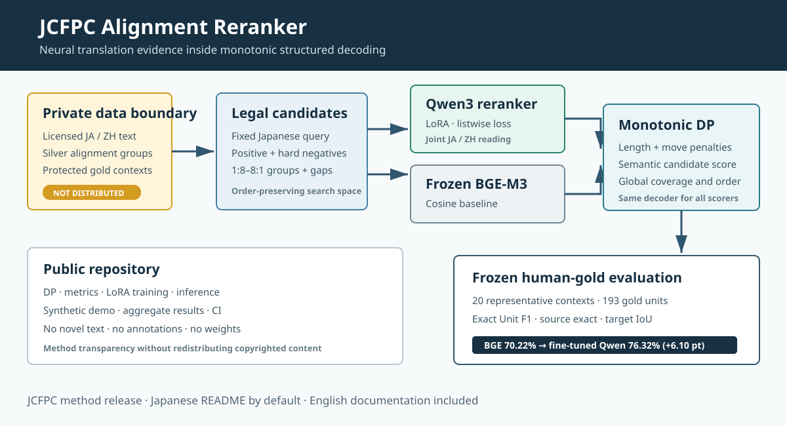
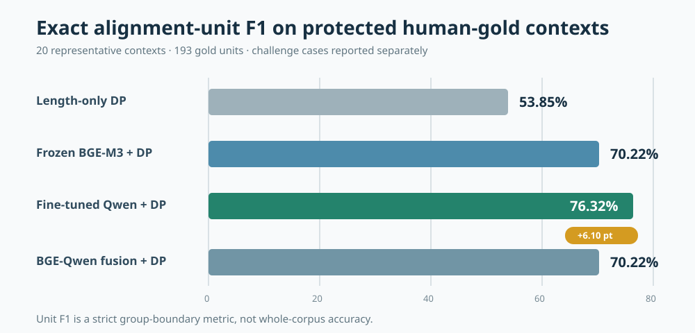

<p align="right"><a href="README.md">日本語</a> | <strong>English</strong></p>

<p align="center">
  
</p>

# JCFPC Alignment Reranker

**A copyright-safe research implementation of candidate generation, neural reranking, and monotonic dynamic programming for Japanese-Chinese literary alignment.**

[](https://github.com/lzq628/jcfpc-alignment-reranker/actions/workflows/ci.yml)


This repository publishes the **NLP method layer** developed while building the
Japanese-Chinese Fiction Parallel Corpus (JCFPC). It contains no copyrighted novel
text, human annotations, trained LoRA weights, or text-bearing model outputs.
Instead, it provides a synthetic runnable example, the monotonic DP implementation,
Qwen3-Reranker-8B LoRA training and inference code, and aggregate evaluation results.

## Highlights

- Monotonic DP with `1:8–8:1` sentence groups and explicit gap moves
- Controlled comparison of BGE-M3 cosine, direct Qwen reranking, and score fusion
- Qwen3-Reranker-8B LoRA with fixed queries, hard negatives, and listwise loss
- Zero sentence-ID and normalized exact-text overlap between training and protected evaluation contexts
- `+6.10` point Unit F1 over frozen BGE-M3 + the same DP decoder
- Hash verification, resumable training, aggregate reporting, and bootstrap diagnostics

## Method

Embedding models are fast, but semantic similarity is not identical to complete
translation coverage. A long candidate may score highly because its opening matches,
while a valid literary paraphrase may have low cosine similarity.

The reranker jointly reads a Japanese sentence group and a Chinese candidate group.
Its score supplies local translation evidence; monotonic DP enforces document order,
coverage, and globally consistent sentence-group boundaries.

## Results

<p align="center">
  
</p>

The primary evaluation contains 20 protected, fully adjudicated contexts with
193 gold alignment units. Model predictions were hidden during annotation.

| Scorer + decoder | Unit Precision | Unit Recall | Unit F1 |
|---|---:|---:|---:|
| Length-only DP | 62.76% | 47.15% | 53.85% |
| Frozen BGE-M3 + DP | 76.69% | 64.77% | 70.22% |
| **Fine-tuned Qwen3 reranker + DP** | **82.53%** | **70.98%** | **76.32%** |
| BGE-Qwen score fusion + DP | 76.69% | 64.77% | 70.22% |

The paired case-bootstrap Qwen-minus-BGE interval was `+1.69` to `+11.70` points,
with `99.66%` of 10,000 resamples above zero. This is an uncertainty diagnostic,
not a formal significance test. Twelve known difficult contexts are reported as a
separate challenge set. See [reports/aggregate_metrics.json](reports/aggregate_metrics.json).

## Baselines and fusion

The `70.22%` baseline is **frozen BGE-M3 cosine + the same monotonic DP decoder**.
The length-only baseline is `53.85%`.

The hybrid is score-level late fusion, not BGE retrieval followed by Qwen reranking:

```text
hybrid = 0.9 * BGE cosine + 0.1 * sigmoid(Qwen logit / 2)
```

It selected exactly the same gold-evaluation paths as BGE, so this repository does
not claim a hybrid improvement. The positive result is direct Qwen scoring + DP.

## Data isolation

LoRA training used 16,921 queries and 219,704 candidates. Independent checks found:

```text
gold_train_sentence_id_overlap = 0
gold_train_normalized_sentence_text_overlap = 0
```

The protected contexts still come from the same five works and from historically
inspected audit contexts. They are not described as unseen books or a prospective blind sample.

## Quick start

```bash
python -m venv .venv
source .venv/bin/activate          # Windows: .venv\Scripts\activate
python -m pip install -e ".[test]"
pytest -q
python -m jcfpc_alignment.demo
```

The demo uses synthetic sentences only.

## LoRA training

Training requires a BF16-capable GPU and privately supplied, properly licensed data.

```bash
python -m pip install -e ".[train]"
python scripts/train_qwen_reranker.py \
  --data data/private/candidates \
  --output runs/qwen8
```

See [docs/DATA_SCHEMA.md](docs/DATA_SCHEMA.md) for the input contract and mandatory
leakage checks.

## Repository layout

```text
src/jcfpc_alignment/       public DP, metrics, and synthetic demo
scripts/                   Qwen LoRA training and candidate scoring
examples/                  copyright-safe synthetic data
reports/                   aggregate, text-free results
docs/                      diagrams and data contract
tests/                     DP and metric regression tests
```

## Not distributed

- Japanese novels or published Chinese translations
- Real `train.jsonl`, `dev.jsonl`, gold workbooks, or context windows
- Sentence-level annotations, candidate scores, or corpus databases
- Private cloud packages, checkpoints, or LoRA adapters

## Limitations

- `76.32%` is exact Unit F1 on protected contexts, not whole-corpus accuracy.
- Gold annotation is single-author; no inter-annotator agreement is available.
- The challenge set is separate and was never used for parameter tuning.
- Adapter redistribution and memorization risk have not been cleared, so weights are private.

## License

Code and original diagrams in this repository are available under the MIT License.
Third-party models, data, and publications remain subject to their own terms.
